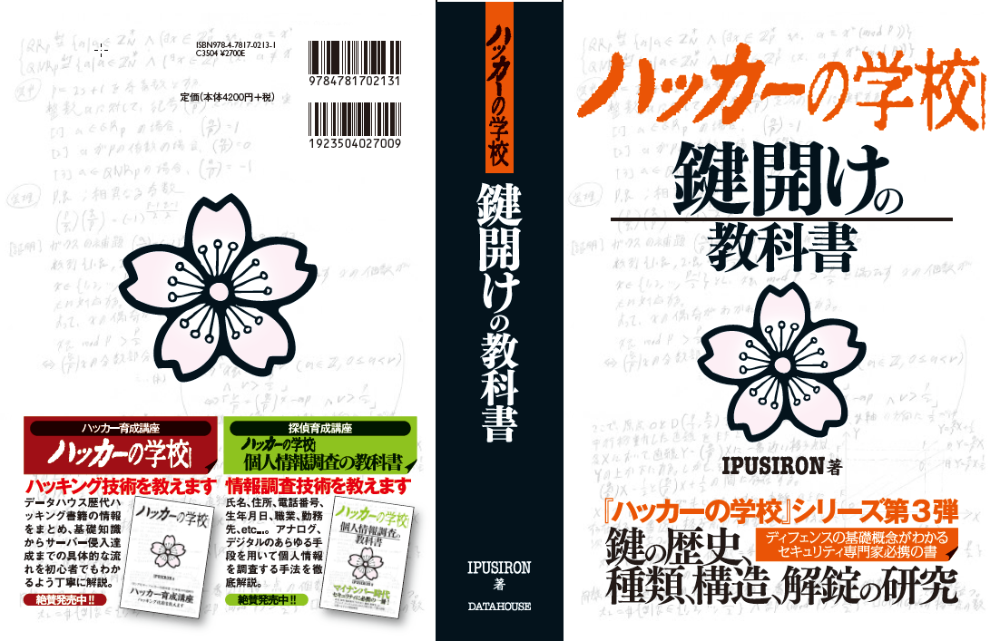

<!-- @format -->

<!--
[内容]
* 導入
  * 自己紹介
  * 物理鍵と電子鍵
* 鍵の種類の紹介
* ピンタンブラー錠の仕組み
* ピッキング
  * ピンタンブラー錠のピッキング
* ピッキング対策
  * 結局何使えばいいの？
* 興味を持った人へ
  * 鍵師の紹介
  * 鍵師講座の紹介
* 想定Q&A
-->

# <mdi-lock /> 物理鍵の仕組みと開け方

物理鍵の仕組みと開け方を <b>超簡単に</b> 紹介

<mdi-arrow-down-bold-outline />詳しく資料が見たい方はこちら！
  <a href=https://xryuseix.github.io/lt/locksmith>
    
    https://xryuseix.github.io/lt/locksmith
  </a>

---

# 自己紹介

##  石川琉聖

 

- 立命館大学 サイバーセキュリティ研究室 **3**回生
- アルゴリズムとセキュリティに興味があります
  - SecHack365'20 研究駆動コース
  - Seccamp'19 暗号化通信ゼミ
  - AtCoder **水色** / CodeForces **青色**
- Web サイト <mdi-arrow-right-bold-outline /> [https://xryuseix.github.io](https://xryuseix.github.io)
- アカウント <mdi-arrow-right-bold-outline /> [<carbon-logo-twitter />@ryusei_ishika](https://twitter.com/ryusei_ishika) / [<carbon-logo-github /> xryuseix](https://github.com/xryuseix)
  - ID はだいたい **xryuseix** です
- SecHack での研究テーマ
  - 競プロのプログラムの盗作検知
  - [Zoom のバーチャル背景適用動画から部屋の復元](https://github.com/Tsuku43/zoomg)

  

## 好きな ○○

 

- 言語 <mdi-arrow-right-bold-outline /> <logos-c-plusplus /> C++, <logos-rust style="background:white"/> Rust, <logos-python /> Python
  
- エディタ <mdi-arrow-right-bold-outline /> <vscode-icons-file-type-vscode /> VSCode
- OS <mdi-arrow-right-bold-outline /> <mdi-apple /> macOS (M1)
- データ構造 <mdi-arrow-right-bold-outline /> <carbon-decision-tree /> Segment Tree
- キーボード <mdi-arrow-right-bold-outline /> <carbon-keyboard /> REALFORCE

---
layout: image-right
image: /padlock.jpg
---

# 今回話すこと

1. 鍵の種類の紹介
2. ピンタンブラー錠の仕組み
3. ピッキング
4. ピッキング対策
5. 興味を持った方へ

画像: <a href="https://ja.wikipedia.org/wiki/南京錠">https://ja.wikipedia.org/wiki/南京錠</a>

---

# 1. 鍵の種類の紹介

## 電子鍵

  

     
    皆さんが詳しいやつです．
    <ul>
      <li>公開鍵</li>
      <li>秘密鍵</li>
    </ul>
    などがありますね．
     
     
    CTF でも暗号分野でよく使われています． 
    ところで，今日は  
    
TsukuCTF

    が併催されています．僕も数問提供しています．
  

  

    
    画像: 映画サマーウォーズ
  

  <a href="https://tsukuctf.sechack365.com">
    
    https://tsukuctf.sechack365.com/
  </a>

---

# 1. 鍵の種類の紹介

## 物理鍵

<table class="table">
  <tr>
    <td class="table-img">
      <a href="https://www.miwa-lock.co.jp/lock_day/lineup/cylinder/subbnr/hole1.gif">
        玄関錠
      </a>
    </td>
    <td class="table-img">
      <a href="https://content.misumi-ec.com/image/upload/t_popover_main/v1/p/jp/product/series/223300463137/223300463137_001.jpg">
        ダイヤル錠
      </a>
    </td>
  </tr>
  <tr>
    <td class="table-img">
      <a href="https://www.kk-alpha.com/cp/img/img_alpha11.jpg">
        八万ロック錠
      </a>
    </td>
    <td class="table-img">
      <a href="https://www.kagi110qq.co.jp/test_com/img/works/img_31.png">
        金庫のダイヤル錠
      </a>
    </td>
  </tr>
</table>

---

# 1. 鍵の種類の紹介

## 今回話す錠前について

  

     ピンタンブラー錠
    
  

---

# 2. ピンタンブラー錠の仕組み

  

---

# 2. ピンタンブラー錠の仕組み

<table class="table">
  <tr>
    <td class="table-img">
      <a href="https://ja.wikipedia.org/wiki/ピンタンブラー錠">
        1.何もさしていない状態
      </a>
    </td>
    <td class="table-img">
      <a href="https://ja.wikipedia.org/wiki/ピンタンブラー錠">
        2.違う鍵をさした状態
      </a>
    </td>
  </tr>
  <tr>
    <td class="table-img">
      <a href="https://ja.wikipedia.org/wiki/ピンタンブラー錠">
        3.合鍵をさした状態
      </a>
    </td>
    <td class="table-img">
      <a href="https://ja.wikipedia.org/wiki/ピンタンブラー錠">
        4.合鍵で回した状態
      </a>
    </td>
  </tr>
</table>

---

# 2. ピンタンブラー錠の仕組み

<video controls>
  <source src="/padlock_skeleton.mp4" type="video/mp4">
</video>

---

# 3. ピッキング

<video controls>
  <source src="/padlock_pick.mp4" type="video/mp4">
</video>

---

# 3. ピッキング

<h2>前提知識</h2>

 

  ところで，一人暮らしで撮影しながら作業するのは大変でした．ピッキングは両手必要ですからね，足で撮影してました．夏の風物詩・鬱クワガタ！w

---

# 3. ピッキング

<h2>前提知識</h2>

 

  ところで，一人暮らしで撮影しながら作業するのは大変でした．ピッキングは両手必要ですからね，足で撮影してました．夏の風物詩・鬱クワガタ！w

---

# 3. ピッキング

<h2>道具</h2>

  

    <ul>
      <li>テンション(上の棒)</li>
      <li>ピック(下の棒)</li>
    </ul>
  

  

    
  

注意: 特殊開錠用具所持禁止法より，この工具は所持自体が違法です！！！  
(僕は鍵師資格を所持しています)

---

# 3. ピッキング

<h2>開け方の手順</h2>

 

注意: 特殊開錠用具所持禁止法より，この工具は所持自体が違法です！！！  
(僕は鍵師資格を所持しています)

---

# 3. ピッキング

<h2>なぜ開くのか</h2>

  

    <ol>
      <li>テンションをかけると上ピンが内筒と外筒の間に引っかかる</li>
      <li>引っかかった状態で下ピンをピックで軽く押すと， 上ピンが下に落ちて来なくなる</li>
      <li>下ピンは引っかかることなく，重力でおちる</li>
      <li>シェアラインが揃う！</li>
    </ol>
  

  

    
    
    <a href="http://s-akademeia.sakura.ne.jp/main/books/lock/">
    画像: ハッカーの学校 鍵開けの教科書 P176
    </a>
  

---

# 3. ピッキング

<video controls>
  <source src="/padlock_pick.mp4" type="video/mp4">
</video>

---

# 3. ピッキング

<video controls>
  <source src="/pick_fast.mp4" type="video/mp4">
</video>

---

# 4. ピッキング対策

## そんな簡単に開いたら困るだろ！！！！！！

つまり

<h2><mdi-arrow-right-bold-outline />南京錠はDES暗号みたいなものです</h2>

専門知識を持った人はすぐ開く，そうではない人は開かない．

<h2><mdi-arrow-right-bold-outline />特に玄関錠はちゃんとしてないと困る！！！</h2>

空いたら困るシリーズだと，あとは金庫とかね．金庫は今回話しませんが，簡単なものは20分くらいで開きます．  
(南京錠と比べるとかなり難しい)

---

# 4. ピッキング対策

## 4-1. ピン数を増やす / ピンの位置をずらす

  

---

# 4. ピッキング対策

## 4-2. アンチピッキングピン

  

     普通のピン
    
  

  

     異形ピン
    
  

---

# 4. ピッキング対策

## 4-2. アンチピッキングピン

  

     画像: ハッカーの学校 鍵開けの教科書 P186
    
  

  

     異形ピン
    
  

  ↑鍵開けの教科書わかりやすくない？？全人類買いましょう^^

---

# 4. ピッキング対策

## これまでの対策は初歩の初歩です

 

* 今の玄関錠はこの何倍も開きにくくなる対策をいっぱいしてます．
* 破錠(ドリリング)対策もしてます．
* なので開かないです(開く場合もありますが)．

<h2>一般人の一番の対策は空き巣に入るときに</h2>
<h2 style="text-align:center;margin: 10px;">「開けるのめんどくせえな」「他の家にしよう」</h2>
<h2 style="text-align:right">と思わせることです．</h2>

  なんとしても玄関を開けたいと思われるような<b>豪邸にお住みの方</b>，至急ご連絡ください．叙々苑にいきましょう．

---

# 4. ピッキング対策

## じゃあ玄関にはどの鍵使えばいいの？

  

     
    とりま MIWA U9 を使っておけばおk 
    (まあ鍵屋さん行って)
     
    <ul>
      <li>ピッキングは絶対に無理</li>
      <li>破錠も厳しい(時間がかかる)</li>
      <li>↑場合によっては壁突き破った方が楽</li>
    </ul>
  

  

    
  

---

# 5. 興味を持った方へ

## 入門はとりあえずこれが良き

  

    <a href="http://s-akademeia.sakura.ne.jp/main/books/lock/">
    
    ハッカーの学校 鍵開けの教科書
    </a>
  

---

# 5. 興味を持った方へ

## ピッキング(実技)も知りたい

  

    
    Youtubeで「ピッキング 鍵」とかで検索 (<code>鍵</code>がないとギターが出てくる)
  

---

# 5. 興味を持った方へ

## ピッキングしてみたい

  

     
    鍵師として働くための講習が受けられます
    <ul>
      <li>ピッキング</li>
      <li>合鍵作成</li>
      <li>シリンダー交換</li>
    </ul>
    など
  

  

    
    僕の場合，講習代+試験代+交通費+飲食費=15,6万くらいでした
  

---

# 6. 最後に

  物理 & サイバー ハッキングを 
  是非両方やってみませんか？？？

  以上！ご静聴ありがとうございました！！

